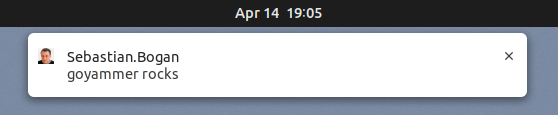

# goyammer

Notify about new Yammer messages (private ones as well as messages in subscribed
groups).

## Register App

Follow [this](https://developer.yammer.com/docs/app-registration) guide to
register a Yammer app and to optain a client ID.

## Login:

After an app has been registered, one needs to get a Yammer access token. Using:

    goyammer login --client <xyz>

where `xyz` must be replaced with the client ID.

If successful, the accquired Yammer access token will be stored in
`~/.goyammer`.

Note, this only needs to be done once.

## Poll:

Using:

    goyammer [poll] [--interval <seconds>]

one starts the polling and notification.

Note, by default, when polling, goyammer will “fork” itself and detach from the
terminal.

## Screenshot

## Install

Build it yourself or simply install the released .deb package.

For autostarting run:

    gnome-session-properties

and add an entry like:

    /usr/bin/goyammer --output /home/sebo/goyammer.log

(which will create `~/.config/autostart/goyammer.desktop`)

<!--
# Local Variables:
# mode: markdown
# ispell-local-dictionary: "english"
# eval: (flyspell-mode 1)
# coding: utf-8
# End:
-->
